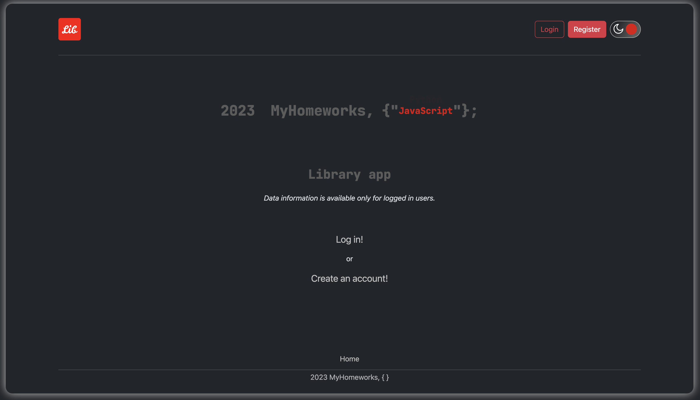
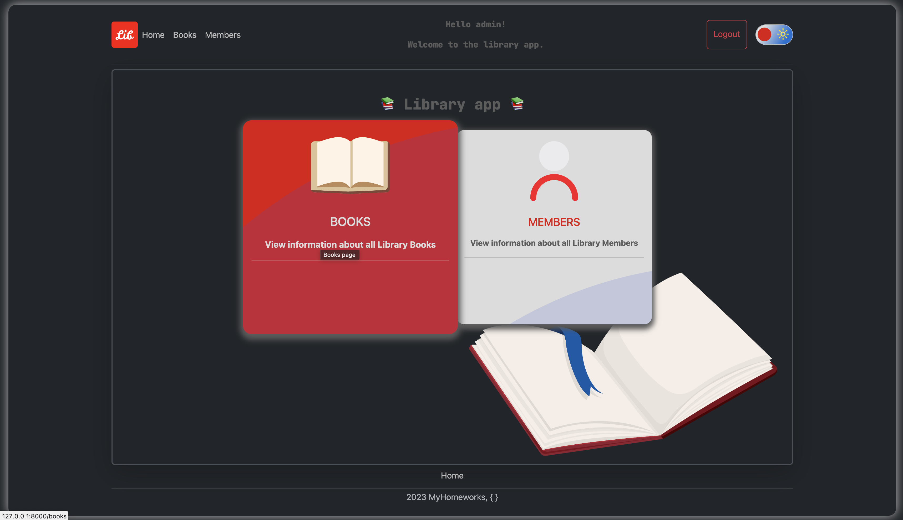
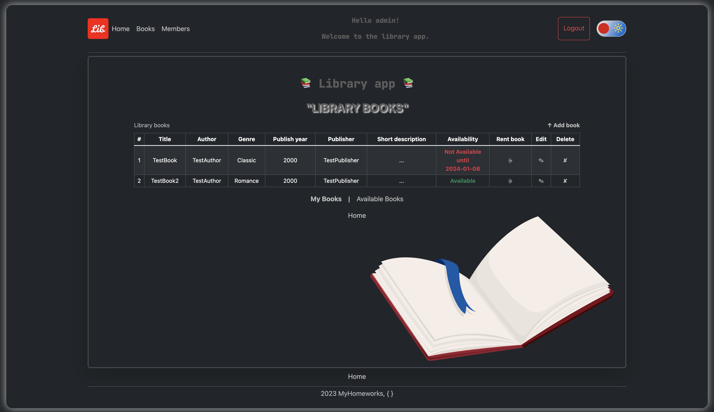
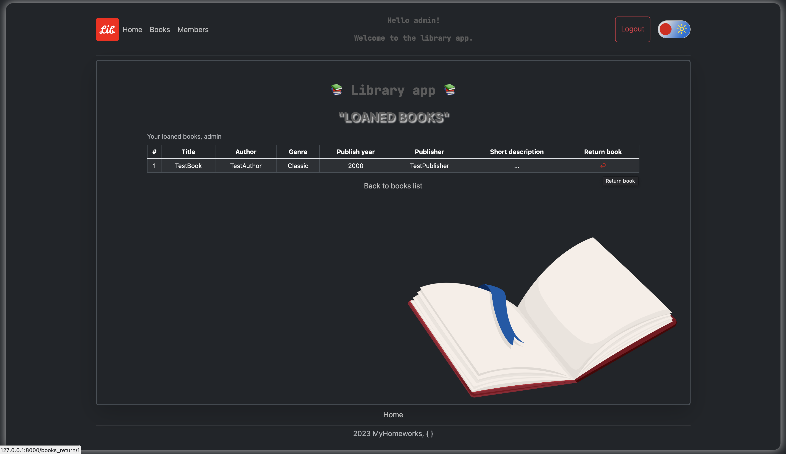

## Description
This is a Django test project using MYSQL and Docker.


## Launch instructions


1. Clone repository to your local folder;
2. Copy dev.env to .env file: ```cp dev.env .env```;
3. Open and follow the instructions in the new created .env file;
4. For this step you should already have installed Docker and docker-compose on your PC:
- Run docker-compose: ```docker-compose up --build```;
- Installation can take some time, it depends on your PC resources;
- After the installation is completed, the server will start automatically on 0.0.0.0:8800;
- Open app using http://0.0.0.0:8800/ in your browser;
5. Superuser is already exists (login: admin, pass: admin);
- change password for superuser: ```python3 manage.py changepassword <user_name>``` ;
6. There are 3 groups with its own permissions: admins, workers and members.
- new Users registered always as a **member** with only **view permisions**;
- you can change permission group for each user under admin in Django adminService (```http://0.0.0.0:8800/admin```) using your **admin credentials**;
7. To stop the server: ```Ctrl+C```;
8. To completely remove all created docker containers, images and volumes: ```docke-compose down --volumes```.

### Screenshots 

1. Main page


2. Select part


3. All books in the library


4. User's books

